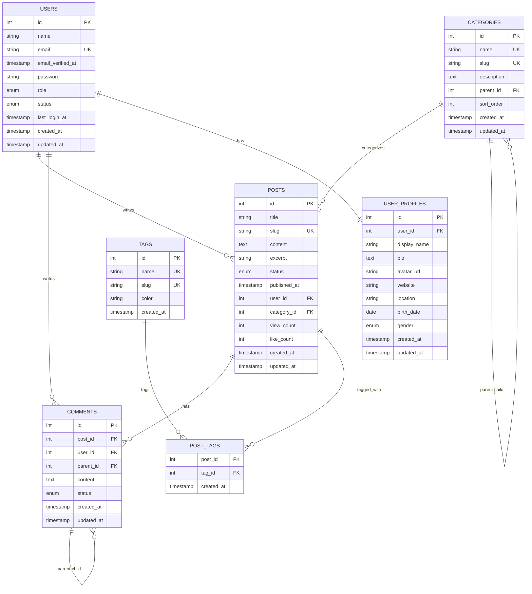
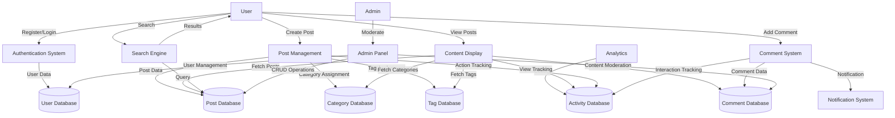

# 7. データベース設計・ドキュメント

## 7.1 テーブル設計

### 7.1.1 正規化

#### 第1正規化 (1NF)
- 各カラムの値は原子値（分割不可能な値）
- 各行は一意に識別可能（主キーが必要）
- 同じデータの繰り返しがない

```sql
-- Bad: 非正規化テーブル
CREATE TABLE users_bad (
    id INT PRIMARY KEY,
    name VARCHAR(255),
    phone_numbers TEXT,  -- "「090-1234-5678, 080-9876-5432」"
    hobbies TEXT         -- "「読書,映画鑑賞,料理」"
);

-- Good: 正規化テーブル
CREATE TABLE users (
    id INT PRIMARY KEY,
    name VARCHAR(255) NOT NULL,
    created_at TIMESTAMP DEFAULT CURRENT_TIMESTAMP,
    updated_at TIMESTAMP DEFAULT CURRENT_TIMESTAMP ON UPDATE CURRENT_TIMESTAMP
);

CREATE TABLE user_phones (
    id INT PRIMARY KEY AUTO_INCREMENT,
    user_id INT NOT NULL,
    phone_number VARCHAR(20) NOT NULL,
    type ENUM('mobile', 'home', 'work') DEFAULT 'mobile',
    created_at TIMESTAMP DEFAULT CURRENT_TIMESTAMP,
    FOREIGN KEY (user_id) REFERENCES users(id) ON DELETE CASCADE
);

CREATE TABLE hobbies (
    id INT PRIMARY KEY AUTO_INCREMENT,
    name VARCHAR(100) NOT NULL UNIQUE,
    created_at TIMESTAMP DEFAULT CURRENT_TIMESTAMP
);

CREATE TABLE user_hobbies (
    user_id INT NOT NULL,
    hobby_id INT NOT NULL,
    created_at TIMESTAMP DEFAULT CURRENT_TIMESTAMP,
    PRIMARY KEY (user_id, hobby_id),
    FOREIGN KEY (user_id) REFERENCES users(id) ON DELETE CASCADE,
    FOREIGN KEY (hobby_id) REFERENCES hobbies(id) ON DELETE CASCADE
);
```

#### 第2正規化 (2NF)
- 1NFを満たす
- 部分関数従属を除去（非主キー属性は主キー全体に完全関数従属）

```sql
-- Bad: 第2正規化違反
CREATE TABLE order_items_bad (
    order_id INT,
    product_id INT,
    product_name VARCHAR(255),    -- product_idに部分的に依存
    product_price DECIMAL(10,2),  -- product_idに部分的に依存
    quantity INT,
    PRIMARY KEY (order_id, product_id)
);

-- Good: 第2正規化適合
CREATE TABLE products (
    id INT PRIMARY KEY AUTO_INCREMENT,
    name VARCHAR(255) NOT NULL,
    price DECIMAL(10,2) NOT NULL,
    created_at TIMESTAMP DEFAULT CURRENT_TIMESTAMP
);

CREATE TABLE order_items (
    order_id INT NOT NULL,
    product_id INT NOT NULL,
    quantity INT NOT NULL DEFAULT 1,
    unit_price DECIMAL(10,2) NOT NULL, -- 注文時の価格を保存
    created_at TIMESTAMP DEFAULT CURRENT_TIMESTAMP,
    PRIMARY KEY (order_id, product_id),
    FOREIGN KEY (order_id) REFERENCES orders(id) ON DELETE CASCADE,
    FOREIGN KEY (product_id) REFERENCES products(id) ON DELETE RESTRICT
);
```

#### 第3正規化 (3NF)
- 2NFを満たす
- 推移的関数従属を除去（非主キー属性間の関数従属を除去）

```sql
-- Bad: 第3正規化違反
CREATE TABLE employees_bad (
    id INT PRIMARY KEY,
    name VARCHAR(255),
    department_id INT,
    department_name VARCHAR(255),  -- department_id経由でnameに依存
    department_manager VARCHAR(255) -- department_id経由でmanagerに依存
);

-- Good: 第3正規化適合
CREATE TABLE departments (
    id INT PRIMARY KEY AUTO_INCREMENT,
    name VARCHAR(100) NOT NULL,
    manager_name VARCHAR(255),
    created_at TIMESTAMP DEFAULT CURRENT_TIMESTAMP
);

CREATE TABLE employees (
    id INT PRIMARY KEY AUTO_INCREMENT,
    name VARCHAR(255) NOT NULL,
    department_id INT NOT NULL,
    created_at TIMESTAMP DEFAULT CURRENT_TIMESTAMP,
    FOREIGN KEY (department_id) REFERENCES departments(id) ON DELETE RESTRICT
);
```

### 7.1.2 インデックス設計

```sql
-- プライマリキー（自動的にインデックス作成）
CREATE TABLE posts (
    id INT PRIMARY KEY AUTO_INCREMENT,
    title VARCHAR(255) NOT NULL,
    slug VARCHAR(255) NOT NULL UNIQUE,  -- UNIQUEキー（自動インデックス）
    content TEXT NOT NULL,
    status ENUM('draft', 'published', 'archived') NOT NULL DEFAULT 'draft',
    published_at TIMESTAMP NULL,
    user_id INT NOT NULL,
    category_id INT,
    created_at TIMESTAMP DEFAULT CURRENT_TIMESTAMP,
    updated_at TIMESTAMP DEFAULT CURRENT_TIMESTAMP ON UPDATE CURRENT_TIMESTAMP,
    
    -- 外部キーインデックス（自動作成）
    FOREIGN KEY (user_id) REFERENCES users(id) ON DELETE CASCADE,
    FOREIGN KEY (category_id) REFERENCES categories(id) ON DELETE SET NULL,
    
    -- コンポジットインデックス（検索パフォーマンス向上）
    INDEX idx_posts_status_published (status, published_at),
    INDEX idx_posts_user_created (user_id, created_at),
    INDEX idx_posts_category_status (category_id, status),
    
    -- フルテキストインデックス（全文検索）
    FULLTEXT KEY ft_posts_content (title, content)
);

-- パフォーマンス監視用インデックス
CREATE TABLE user_activities (
    id BIGINT PRIMARY KEY AUTO_INCREMENT,
    user_id INT NOT NULL,
    activity_type VARCHAR(50) NOT NULL,
    target_id INT,
    target_type VARCHAR(50),
    ip_address VARCHAR(45),
    user_agent TEXT,
    created_at TIMESTAMP DEFAULT CURRENT_TIMESTAMP,
    
    -- ログ解析用インデックス
    INDEX idx_activities_user_created (user_id, created_at),
    INDEX idx_activities_type_created (activity_type, created_at),
    INDEX idx_activities_target (target_type, target_id),
    INDEX idx_activities_created (created_at)  -- 古いデータ消去用
);
```

## 7.2 DBドキュメント

### 7.2.1 テーブル定義書

#### usersテーブル
| カラム名 | データ型 | NULL | デフォルト | キー | 説明 |
|---------|---------|------|---------|------|------|
| id | INT | NO | AUTO_INCREMENT | PK | ユーザーID（主キー） |
| name | VARCHAR(255) | NO | - | - | ユーザー名 |
| email | VARCHAR(255) | NO | - | UQ | メールアドレス（一意） |
| email_verified_at | TIMESTAMP | YES | NULL | - | メール認証日時 |
| password | VARCHAR(255) | NO | - | - | パスワードハッシュ |
| role | ENUM('admin','user','guest') | NO | 'user' | - | ユーザー権限 |
| status | ENUM('active','inactive','suspended') | NO | 'active' | - | ユーザー状態 |
| last_login_at | TIMESTAMP | YES | NULL | - | 最終ログイン日時 |
| created_at | TIMESTAMP | NO | CURRENT_TIMESTAMP | - | 作成日時 |
| updated_at | TIMESTAMP | NO | CURRENT_TIMESTAMP | - | 更新日時 |

**インデックス情報:**
- PRIMARY KEY: id
- UNIQUE KEY: email
- INDEX: status, created_at
- INDEX: last_login_at (for analytics)

#### postsテーブル
| カラム名 | データ型 | NULL | デフォルト | キー | 説明 |
|---------|---------|------|---------|------|------|
| id | INT | NO | AUTO_INCREMENT | PK | 投稿ID（主キー） |
| title | VARCHAR(255) | NO | - | - | タイトル |
| slug | VARCHAR(255) | NO | - | UQ | URLスラッグ（一意） |
| content | TEXT | NO | - | - | 本文 |
| excerpt | VARCHAR(500) | YES | NULL | - | 概要文 |
| status | ENUM('draft','published','archived') | NO | 'draft' | - | 公開状態 |
| published_at | TIMESTAMP | YES | NULL | - | 公開日時 |
| user_id | INT | NO | - | FK | 著者ID（users.id） |
| category_id | INT | YES | NULL | FK | カテゴリーID（categories.id） |
| view_count | INT | NO | 0 | - | 閲覧回数 |
| like_count | INT | NO | 0 | - | いいね回数 |
| created_at | TIMESTAMP | NO | CURRENT_TIMESTAMP | - | 作成日時 |
| updated_at | TIMESTAMP | NO | CURRENT_TIMESTAMP | - | 更新日時 |

**外部キー制約:**
- user_id → users(id) ON DELETE CASCADE
- category_id → categories(id) ON DELETE SET NULL

**インデックス情報:**
- PRIMARY KEY: id
- UNIQUE KEY: slug
- INDEX: status, published_at (for public listing)
- INDEX: user_id, created_at (for user's posts)
- INDEX: category_id, status (for category listing)
- FULLTEXT INDEX: title, content (for search)

### 7.2.2 ER図



### 7.2.3 DFD（データフロー図）



## 7.3 マイグレーション管理

### 7.3.1 マイグレーションファイル作成

```php
<?php
// database/migrations/2024_01_01_000001_create_users_table.php

use Illuminate\Database\Migrations\Migration;
use Illuminate\Database\Schema\Blueprint;
use Illuminate\Support\Facades\Schema;

return new class extends Migration
{
    public function up(): void
    {
        Schema::create('users', function (Blueprint $table) {
            $table->id();
            $table->string('name');
            $table->string('email')->unique();
            $table->timestamp('email_verified_at')->nullable();
            $table->string('password');
            $table->enum('role', ['admin', 'user', 'guest'])->default('user');
            $table->enum('status', ['active', 'inactive', 'suspended'])->default('active');
            $table->timestamp('last_login_at')->nullable();
            $table->rememberToken();
            $table->timestamps();
            
            // インデックス
            $table->index(['status', 'created_at']);
            $table->index('last_login_at');
        });
    }
    
    public function down(): void
    {
        Schema::dropIfExists('users');
    }
};

// database/migrations/2024_01_02_000001_create_posts_table.php
return new class extends Migration
{
    public function up(): void
    {
        Schema::create('posts', function (Blueprint $table) {
            $table->id();
            $table->string('title');
            $table->string('slug')->unique();
            $table->text('content');
            $table->string('excerpt', 500)->nullable();
            $table->enum('status', ['draft', 'published', 'archived'])->default('draft');
            $table->timestamp('published_at')->nullable();
            $table->foreignId('user_id')->constrained()->cascadeOnDelete();
            $table->foreignId('category_id')->nullable()->constrained()->nullOnDelete();
            $table->unsignedInteger('view_count')->default(0);
            $table->unsignedInteger('like_count')->default(0);
            $table->timestamps();
            
            // インデックス
            $table->index(['status', 'published_at']);
            $table->index(['user_id', 'created_at']);
            $table->index(['category_id', 'status']);
            $table->index('view_count'); // 人気記事用
            
            // フルテキストインデックス
            $table->fullText(['title', 'content']);
        });
    }
    
    public function down(): void
    {
        Schema::dropIfExists('posts');
    }
};
```

### 7.3.2 カラム変更マイグレーション

```php
// database/migrations/2024_01_15_000001_add_meta_fields_to_posts_table.php
return new class extends Migration
{
    public function up(): void
    {
        Schema::table('posts', function (Blueprint $table) {
            // 新しいカラムを追加
            $table->json('meta_data')->nullable()->after('content');
            $table->string('featured_image')->nullable()->after('excerpt');
            $table->boolean('is_featured')->default(false)->after('published_at');
            $table->unsignedInteger('comment_count')->default(0)->after('like_count');
            
            // インデックスを追加
            $table->index(['is_featured', 'published_at']);
        });
    }
    
    public function down(): void
    {
        Schema::table('posts', function (Blueprint $table) {
            $table->dropIndex(['is_featured', 'published_at']);
            $table->dropColumn([
                'meta_data',
                'featured_image', 
                'is_featured',
                'comment_count'
            ]);
        });
    }
};
```

### 7.3.3 データ移行マイグレーション

```php
// database/migrations/2024_01_20_000001_migrate_old_post_categories.php
return new class extends Migration
{
    public function up(): void
    {
        // 旧いcategory_nameカラムから新しいcategory_idへデータ移行
        $posts = DB::table('posts')
            ->whereNotNull('category_name')
            ->whereNull('category_id')
            ->get();
            
        foreach ($posts as $post) {
            $category = DB::table('categories')
                ->where('name', $post->category_name)
                ->first();
                
            if ($category) {
                DB::table('posts')
                    ->where('id', $post->id)
                    ->update(['category_id' => $category->id]);
            } else {
                // カテゴリが存在しない場合は新規作成
                $categoryId = DB::table('categories')->insertGetId([
                    'name' => $post->category_name,
                    'slug' => Str::slug($post->category_name),
                    'created_at' => now(),
                    'updated_at' => now()
                ]);
                
                DB::table('posts')
                    ->where('id', $post->id)
                    ->update(['category_id' => $categoryId]);
            }
        }
    }
    
    public function down(): void
    {
        // ロールバック処理（必要に応じて）
        DB::table('posts')
            ->whereNotNull('category_id')
            ->update(['category_id' => null]);
    }
};
```

## 7.4 シーダー・ファクトリー

### 7.4.1 ファクトリー定義

```php
// database/factories/UserFactory.php
namespace Database\Factories;

use Illuminate\Database\Eloquent\Factories\Factory;
use Illuminate\Support\Facades\Hash;
use Illuminate\Support\Str;

class UserFactory extends Factory
{
    public function definition(): array
    {
        return [
            'name' => $this->faker->name(),
            'email' => $this->faker->unique()->safeEmail(),
            'email_verified_at' => $this->faker->optional(0.8)->dateTime(),
            'password' => Hash::make('password'),
            'role' => $this->faker->randomElement(['admin', 'user', 'guest']),
            'status' => $this->faker->randomElement(['active', 'inactive']),
            'last_login_at' => $this->faker->optional(0.7)->dateTimeBetween('-1 month'),
        ];
    }
    
    public function admin(): static
    {
        return $this->state([
            'role' => 'admin',
            'status' => 'active',
            'email_verified_at' => now(),
        ]);
    }
    
    public function unverified(): static
    {
        return $this->state([
            'email_verified_at' => null,
        ]);
    }
    
    public function inactive(): static
    {
        return $this->state([
            'status' => 'inactive',
            'last_login_at' => null,
        ]);
    }
}

// database/factories/PostFactory.php
class PostFactory extends Factory
{
    public function definition(): array
    {
        $title = $this->faker->sentence(6, true);
        $isPublished = $this->faker->boolean(70); // 70%の確率で公開
        
        return [
            'title' => rtrim($title, '.'),
            'slug' => Str::slug($title) . '-' . Str::random(5),
            'content' => $this->faker->paragraphs(rand(5, 15), true),
            'excerpt' => $this->faker->optional(0.8)->text(200),
            'status' => $isPublished ? 'published' : $this->faker->randomElement(['draft', 'archived']),
            'published_at' => $isPublished ? $this->faker->dateTimeBetween('-6 months') : null,
            'view_count' => $this->faker->numberBetween(0, 10000),
            'like_count' => $this->faker->numberBetween(0, 500),
        ];
    }
    
    public function published(): static
    {
        return $this->state([
            'status' => 'published',
            'published_at' => $this->faker->dateTimeBetween('-1 year'),
        ]);
    }
    
    public function draft(): static
    {
        return $this->state([
            'status' => 'draft',
            'published_at' => null,
        ]);
    }
    
    public function popular(): static
    {
        return $this->state([
            'view_count' => $this->faker->numberBetween(5000, 50000),
            'like_count' => $this->faker->numberBetween(100, 1000),
        ]);
    }
}
```

### 7.4.2 シーダー実装

```php
// database/seeders/DatabaseSeeder.php
namespace Database\Seeders;

use Illuminate\Database\Seeder;
use App\Models\{User, Category, Post, Tag};

class DatabaseSeeder extends Seeder
{
    public function run(): void
    {
        // 管理者ユーザー作成
        $admin = User::factory()->admin()->create([
            'name' => 'Admin User',
            'email' => 'admin@example.com',
        ]);
        
        // 一般ユーザー作成
        $users = User::factory(50)->create();
        
        // カテゴリ作成
        $this->call(CategorySeeder::class);
        $categories = Category::all();
        
        // タグ作成
        $this->call(TagSeeder::class);
        $tags = Tag::all();
        
        // 投稿作成
        $allUsers = User::all();
        
        // 管理者の投稿（人気記事）
        Post::factory(20)
            ->popular()
            ->published()
            ->for($admin)
            ->create()
            ->each(function ($post) use ($categories, $tags) {
                $post->category()->associate($categories->random());
                $post->tags()->attach($tags->random(rand(1, 5)));
                $post->save();
            });
        
        // 一般ユーザーの投稿
        foreach ($allUsers as $user) {
            Post::factory(rand(0, 15))
                ->for($user)
                ->create()
                ->each(function ($post) use ($categories, $tags) {
                    if ($categories->count() > 0) {
                        $post->category()->associate($categories->random());
                    }
                    if ($tags->count() > 0 && rand(1, 100) <= 80) { // 80%の確率でタグ付与
                        $post->tags()->attach($tags->random(rand(1, 3)));
                    }
                    $post->save();
                });
        }
    }
}

// database/seeders/CategorySeeder.php
class CategorySeeder extends Seeder
{
    public function run(): void
    {
        $categories = [
            ['name' => 'テクノロジー', 'slug' => 'technology', 'description' => '技術関連の記事'],
            ['name' => 'ビジネス', 'slug' => 'business', 'description' => 'ビジネス情報や起業について'],
            ['name' => 'ライフスタイル', 'slug' => 'lifestyle', 'description' => '日常生活や趣味について'],
            ['name' => '健康', 'slug' => 'health', 'description' => '健康やフィットネス情報'],
            ['name' => '教育', 'slug' => 'education', 'description' => '学習やスキルアップ情報'],
        ];
        
        foreach ($categories as $category) {
            Category::create(array_merge($category, [
                'created_at' => now(),
                'updated_at' => now(),
            ]));
        }
    }
}

// database/seeders/TagSeeder.php
class TagSeeder extends Seeder
{
    public function run(): void
    {
        $tags = [
            'Laravel', 'PHP', 'Vue.js', 'JavaScript', 'MySQL', 'Docker',
            'AWS', 'API', 'REST', 'GraphQL', 'Redis', 'Elasticsearch',
            'マーケティング', 'デザイン', 'UX/UI', 'SEO',
            'プロジェクト管理', 'チームマネジメント',
            'ライフハック', '旅行', '料理', '読書',
        ];
        
        $colors = ['red', 'blue', 'green', 'yellow', 'purple', 'pink', 'indigo', 'gray'];
        
        foreach ($tags as $tagName) {
            Tag::create([
                'name' => $tagName,
                'slug' => Str::slug($tagName),
                'color' => fake()->randomElement($colors),
                'created_at' => now(),
            ]);
        }
    }
}
```

### 7.4.3 テスト用データ作成

```php
// tests/Feature/PostTest.php
class PostTest extends TestCase
{
    use RefreshDatabase;
    
    public function test_user_can_view_published_posts(): void
    {
        // テスト用データ作成
        $user = User::factory()->create();
        $category = Category::factory()->create();
        
        $publishedPosts = Post::factory(5)
            ->published()
            ->for($user)
            ->for($category)
            ->create();
            
        $draftPost = Post::factory()
            ->draft()
            ->for($user)
            ->for($category)
            ->create();
        
        $response = $this->get('/api/posts');
        
        $response->assertOk()
                 ->assertJsonCount(5, 'data')
                 ->assertJsonMissing(['title' => $draftPost->title]);
    }
    
    public function test_user_can_create_post_with_tags(): void
    {
        $user = User::factory()->create();
        $category = Category::factory()->create();
        $tags = Tag::factory(3)->create();
        
        $postData = [
            'title' => 'Test Post',
            'content' => 'This is test content.',
            'category_id' => $category->id,
            'tag_ids' => $tags->pluck('id')->toArray(),
        ];
        
        $response = $this->actingAs($user)
                         ->postJson('/api/posts', $postData);
        
        $response->assertCreated();
        
        $post = Post::where('title', 'Test Post')->first();
        $this->assertCount(3, $post->tags);
    }
}
```