# 8. UML・設計図

## 8.1 UML図表

### 8.1.1 インスタンス図

```mermaid
classDiagram
    class User {
        -id: int
        -name: string
        -email: string
        -password: string
        -role: UserRole
        -status: UserStatus
        +getId(): int
        +getName(): string
        +getEmail(): string
        +isActive(): bool
        +hasRole(role: UserRole): bool
    }
    
    class Post {
        -id: int
        -title: string
        -slug: string
        -content: string
        -status: PostStatus
        -publishedAt: DateTime
        -userId: int
        +publish(): void
        +unpublish(): void
        +isPublished(): bool
        +getAuthor(): User
    }
    
    class Category {
        -id: int
        -name: string
        -slug: string
        -description: string
        +getPosts(): Collection
    }
    
    class Comment {
        -id: int
        -content: string
        -postId: int
        -userId: int
        -parentId: int
        +getReplies(): Collection
        +getParent(): Comment|null
    }
    
    class UserService {
        -userRepository: UserRepositoryInterface
        -emailService: EmailService
        +createUser(data: array): User
        +updateUser(id: int, data: array): User
        +deleteUser(id: int): bool
        +sendWelcomeEmail(user: User): void
    }
    
    class PostService {
        -postRepository: PostRepositoryInterface
        -categoryRepository: CategoryRepositoryInterface
        +createPost(data: array): Post
        +publishPost(id: int): Post
        +getPublishedPosts(): Collection
    }
    
    %% Relationships
    User ||--o{ Post : "writes"
    User ||--o{ Comment : "writes"
    Post ||--o{ Comment : "has"
    Category ||--o{ Post : "categorizes"
    Comment ||--o{ Comment : "parent-child"
    
    UserService --> User : "manages"
    PostService --> Post : "manages"
    PostService --> Category : "uses"
```

### 8.1.2 シーケンス図

#### ユーザー登録フロー
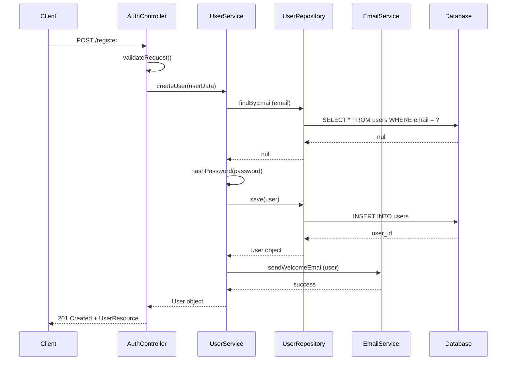

#### 投稿公開フロー
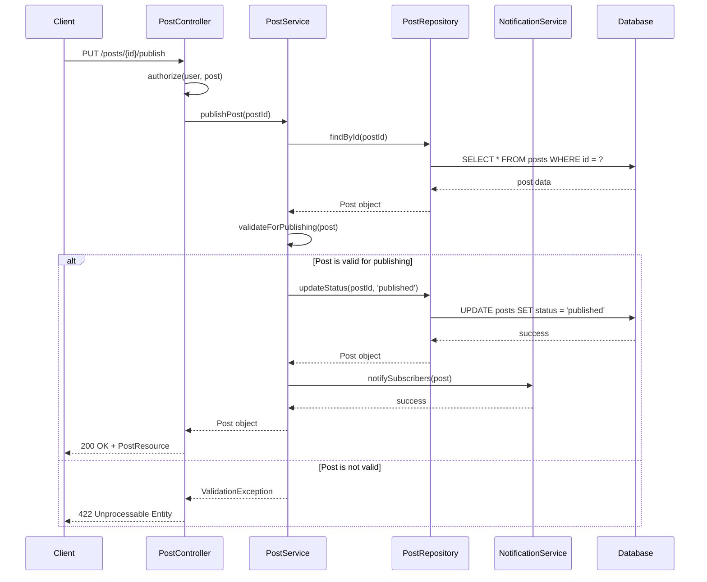

### 8.1.3 クラス図

#### ドメインレイヤー
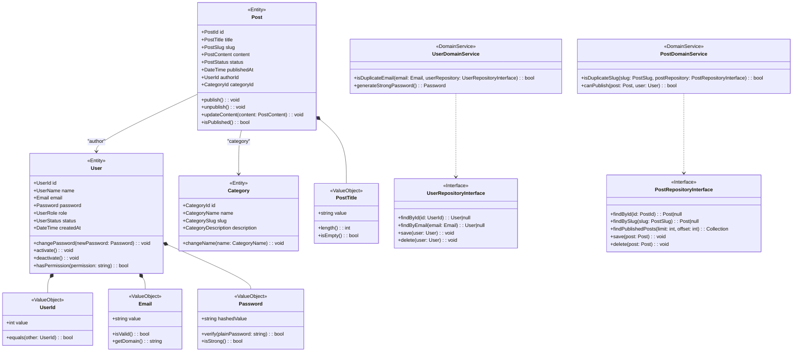

#### アプリケーションレイヤー
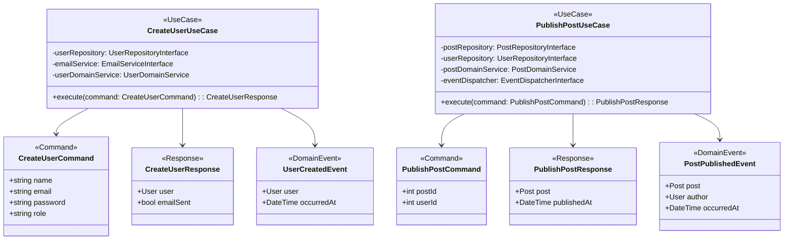

## 8.2 設計ドキュメント

### 8.2.1 アーキテクチャ図

#### 全体アーキテクチャ
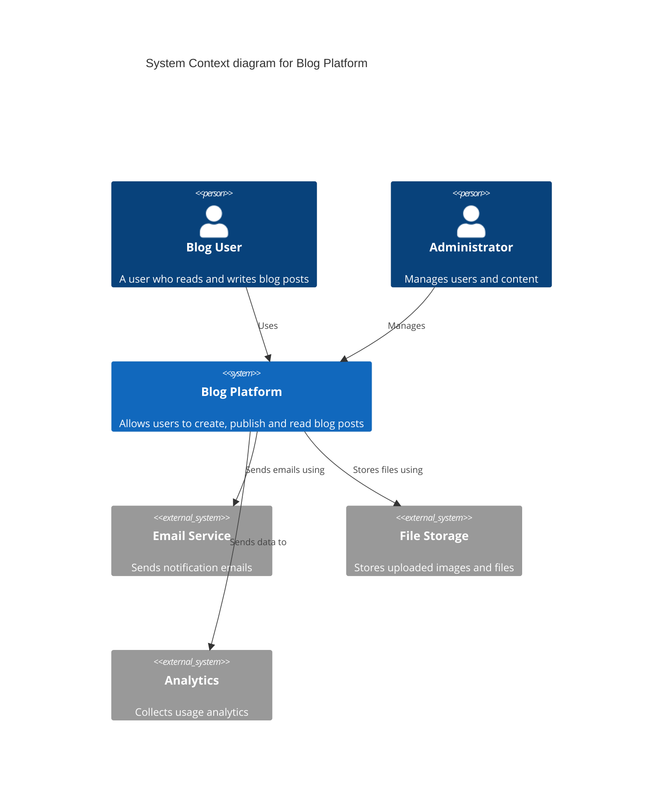

#### コンテナ図
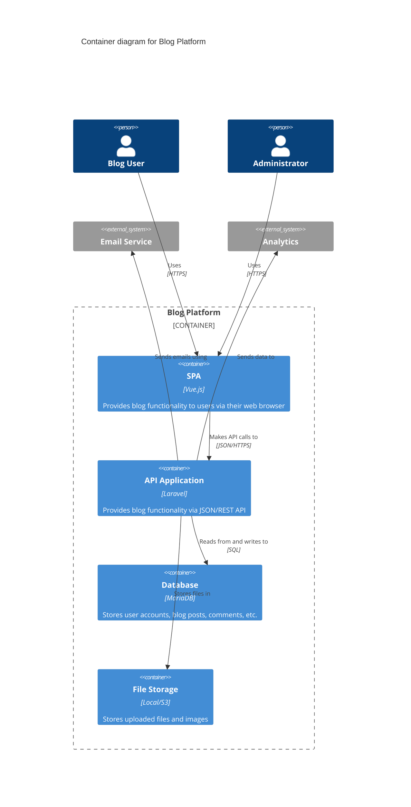

#### コンポーネント図（APIアプリケーション）
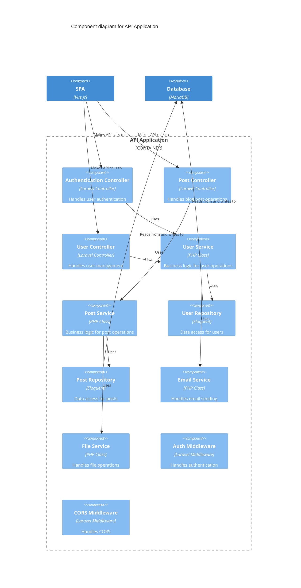

### 8.2.2 フローチャート

#### ユーザー認証フロー
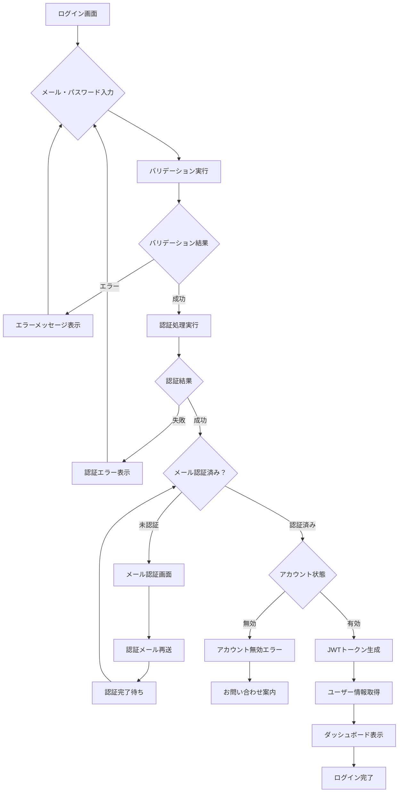

#### 投稿公開フロー
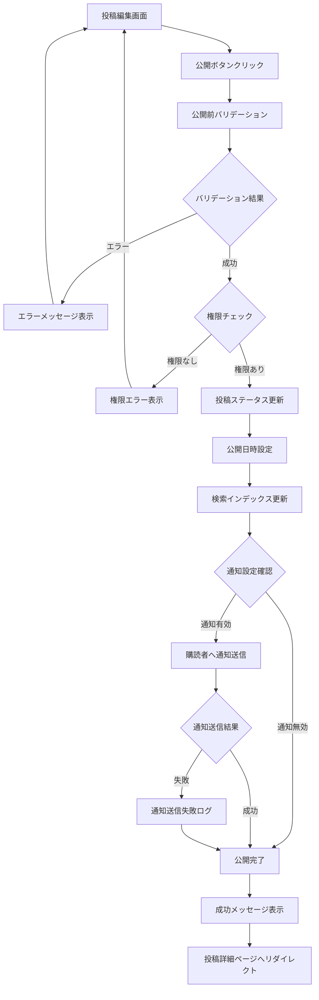

#### データバックアップフロー
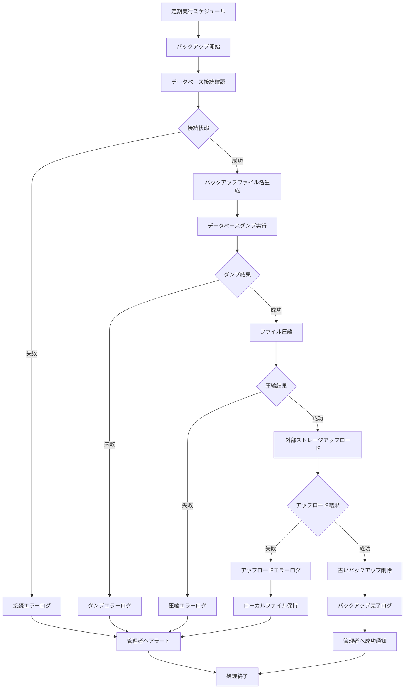

#### エラーハンドリングフロー
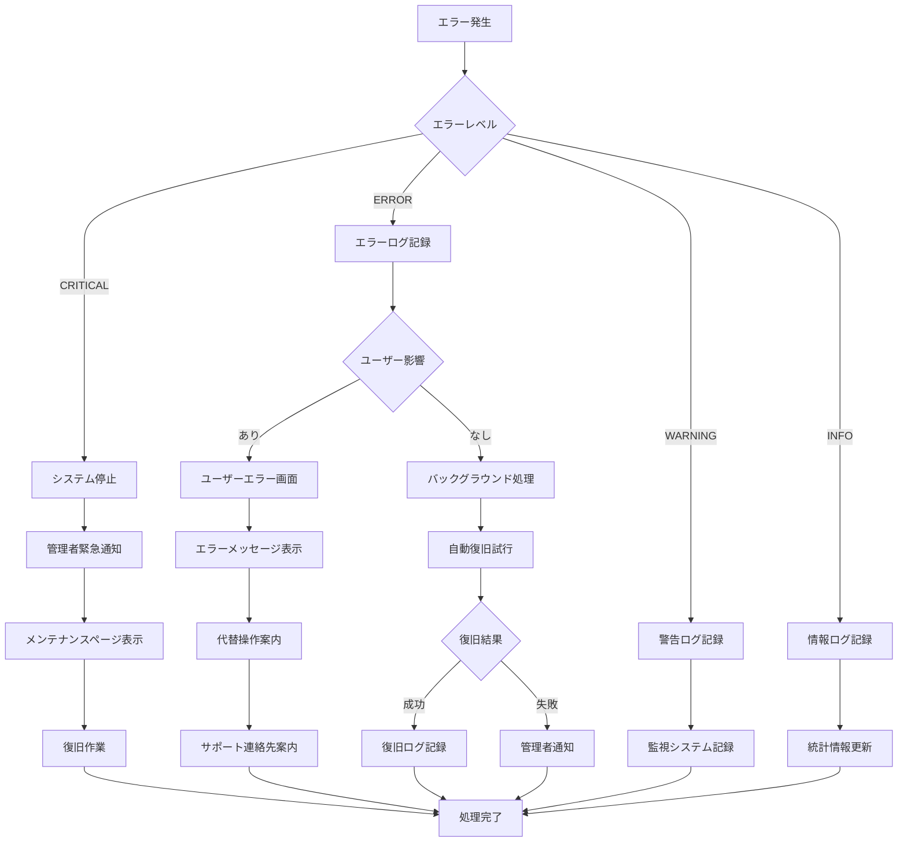
